

  

  <a href="mailto:sainandhanmucharla@gmail.com">Gmail</a>
  ·
  <a href="https://www.linkedin.com/in/sainandhan">LinkedIn</a>
  ·
  <a href="https://www.instagram.com/nandhan2006/">Instagram</a>
  ·
  <a href="https://github.com/SaiNandhan06">GitHub</a>

---

### 👋 About Me

I'm a 3rd-year Computer Science student at KL University, working as an
AI Full-Stack Developer. Most of my time goes into building **RAG
pipelines**, experimenting with **LLMs**, and shipping small end-to-end
AI projects — from the model logic down to the web app around it. This
profile is a running log of what I'm building, learning, and breaking
along the way.

---

### 🤖 RAG Pipeline — live diagram

  

---

### 📉 Training Run

  

---

### 📊 Skills — live from my repos

  

Updates automatically as repos are added — see setup below.

---

### 🧰 Tools — live from my repos

  

---

### 🧩 Currently Exploring

<table>
<tr>
<td width="33%" valign="top">

**🧩 RAG Systems**
- Chunking & retrieval strategies
- Vector search (FAISS, Chroma)
- Hybrid search + reranking

</td>
<td width="33%" valign="top">

**🧠 LLMs**
- Prompt & context engineering
- Fine-tuning open-source models
- Agentic workflows

</td>
<td width="33%" valign="top">

**🐍 Python / ML Tooling**
- LangChain / LlamaIndex
- PyTorch fundamentals
- Building small AI side projects

</td>
</tr>
</table>

---

### 📌 Projects — live from GitHub

<!-- PROJECTS:START -->

<table align="center">
  <tr>
    <td align="center">
      <a href="https://github.com/SaiNandhan06/DevFlowAI" target="_blank">
        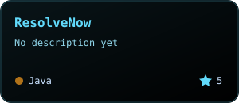
      </a>
    </td>
    <td align="center">
      <a href="https://github.com/SaiNandhan06/SkillStack" target="_blank">
        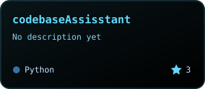
      </a>
    </td>
  </tr>
  <tr>
    <td align="center">
      <a href="https://github.com/SaiNandhan06/codebaseAssisstant" target="_blank">
        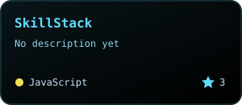
      </a>
    </td>
    <td align="center">
      <a href="https://github.com/SaiNandhan06/leetcode_solutions" target="_blank">
        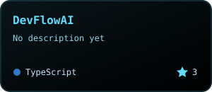
      </a>
    </td>
  </tr>
  <tr>
    <td align="center">
      <a href="https://github.com/SaiNandhan06/DigitalWallet_MicroService" target="_blank">
        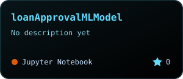
      </a>
    </td>
    <td align="center">
      <a href="https://github.com/SaiNandhan06/QR-CodeGenerator" target="_blank">
        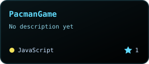
      </a>
    </td>
  </tr>
</table>

<!-- PROJECTS:END -->

---

### 📬 Let's Connect

  
  <a href="https://www.linkedin.com/in/sainandhan" target="_blank">
    
  </a>
  <a href="https://www.instagram.com/nandhan2006/" target="_blank">
    
  </a>
  <a href="https://github.com/SaiNandhan06" target="_blank">
    
  </a>

---

  

